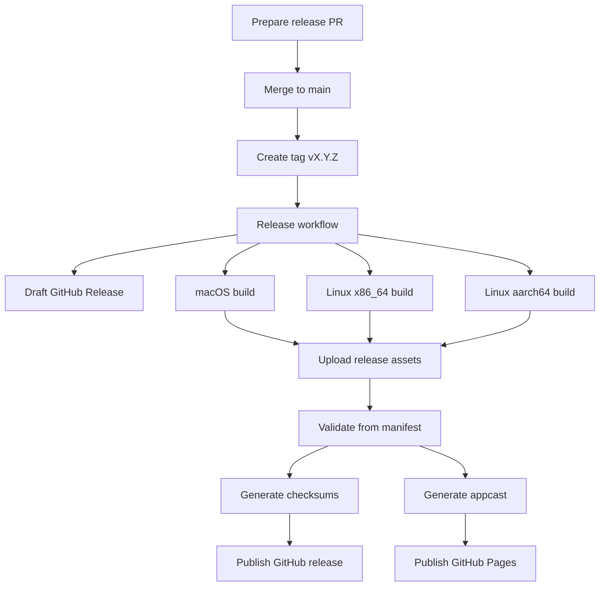

# Release Runbook

This document is the operator runbook for shipping a Séance release.

Use [docs/RELEASE.md](docs/RELEASE.md) for the architecture and manifest model.
Use this file when you are actually preparing, running, verifying, or recovering a release.

## Scope

This runbook covers the current tagged release flow in [.github/workflows/release.yml](.github/workflows/release.yml).

Current release outputs:

- macOS Apple Silicon `.dmg`
- macOS Sparkle update zip
- Linux `x86_64` AppImage
- Linux `aarch64` AppImage
- `SHA256SUMS.txt`
- Sparkle appcast on GitHub Pages

## Owners

- `seance-build` owns release metadata, manifests, checksums, validation, and appcast generation.
- GitHub Actions owns orchestration.
- `scripts/build-macos-release.sh` and `scripts/build-appimage.sh` own platform packaging only.

## Release Diagram



## Preconditions

Before creating the tag, confirm all of the following.

### Repo state

1. `main` contains the release-ready code.
2. [Cargo.toml](Cargo.toml) workspace version matches the intended release version.
3. [CHANGELOG.md](CHANGELOG.md) contains a section for that exact version.
4. CI is green on `main`.

### Runner availability

1. GitHub-hosted `ubuntu-latest` runner is available.
2. GitHub-hosted `macos-14` runner is available.
3. The self-hosted `Linux ARM64` runner is online and healthy.

### Required GitHub secrets

These are referenced directly by [.github/workflows/release.yml](.github/workflows/release.yml).

1. `APPLE_CERT_P12_BASE64`
2. `APPLE_CERT_PASSWORD`
3. `APPLE_SIGNING_IDENTITY`
4. `APPLE_TEAM_ID`
5. `APPLE_API_KEY_ID`
6. `APPLE_API_ISSUER_ID`
7. `APPLE_API_PRIVATE_KEY_BASE64`
8. `SPARKLE_PUBLIC_KEY`
9. `SPARKLE_PRIVATE_KEY`

### Expected external tooling

These are required by the workflow jobs and wrapper scripts.

1. `cargo`
2. `gh`
3. `zig 0.15.2` on build jobs that compile the vendored Ghostty terminal stack
4. `cargo-packager` on the macOS job
5. `codesign`, `notarytool`, and `stapler` on the macOS job
6. `linuxdeploy` and `appimagetool` on Linux packaging jobs

The release workflow installs Zig at runtime on GitHub-hosted runners and expects the self-hosted `Linux ARM64` runner to allow the same tool download during the job.

## Preflight Checks

Run these locally before tagging.

```bash
make check
make clippy
make test
make release-version
make release-notes VERSION=0.1.0
make release-artifacts
```

For a metadata-only dry check against an existing release directory:

```bash
make release-validate RELEASE_DIR=dist/release
make release-checksums RELEASE_DIR=dist/release
```

For Touch ID validation on macOS, do not use `cargo run` or `make app-run`. Create a local signing file and build or launch a signed app bundle instead:

```bash
cp .env.macos-signing.example .env.macos-signing
# edit .env.macos-signing with your Apple team id, Apple Development identity,
# and a macOS development provisioning profile for com.seance.app.dev
make signed-run
codesign -d --entitlements :- dist/dev-macos/Seance.app
security cms -D -i dist/dev-macos/Seance.app/Contents/embedded.provisionprofile
```

If device unlock was enrolled from an unsigned or older build, unlock once with the recovery passphrase in the signed app bundle to re-enroll this device, then relaunch and validate the Touch ID prompt.

Local Touch ID setup requires:

1. An App ID for `com.seance.app.dev`
2. A macOS development provisioning profile for that App ID
3. `APPLE_DEV_PROVISIONING_PROFILE` set in `.env.macos-signing`

If you want to exercise the manifest flow without real signing or packaging, run the manifest smoke path that was already used during implementation and verify these outputs exist:

1. `manifest.json`
2. `release-notes.md`
3. three platform manifests under `manifests/`
4. `SHA256SUMS.txt`
5. `site/sparkle/stable/appcast.xml`

## Release Procedure

### 1. Prepare the release commit

1. Update the workspace version if needed.
2. Update [CHANGELOG.md](CHANGELOG.md) for the release.
3. Merge the release-ready changes to `main`.

### 2. Create the tag

Create and push an annotated tag in `vX.Y.Z` format.

```bash
git tag -a v0.1.0 -m "Séance v0.1.0"
git push origin v0.1.0
```

This triggers [.github/workflows/release.yml](.github/workflows/release.yml).

### 3. Monitor the workflow

Watch the jobs in this order.

1. `prepare`
2. `build-macos-aarch64`
3. `build-linux-x86_64`
4. `build-linux-aarch64`
5. `publish`

Expected behavior:

1. `prepare` writes `dist/release/manifest.json` and creates or reuses a draft release.
2. Each build job produces artifacts and writes a platform manifest.
3. Each build job uploads its platform assets to the draft GitHub release.
4. `publish` downloads the release assets, validates them, uploads checksums, generates the appcast, deploys Pages, and marks the release latest.

## Success Criteria

The release is complete only if all of the following are true.

1. The GitHub release is no longer a draft.
2. The GitHub release contains:
   `seance-macos-aarch64.dmg`
   `seance-macos-aarch64.app.zip`
   `seance-linux-x86_64.AppImage`
   `seance-linux-x86_64.AppImage.zsync`
   `seance-linux-aarch64.AppImage`
   `seance-linux-aarch64.AppImage.zsync`
   `SHA256SUMS.txt`
3. The GitHub Pages appcast is published at the Sparkle feed URL.
4. `gh release view <tag>` shows `latest: true`.

## Post-Release Verification

Run these checks after the workflow succeeds.

### GitHub release

```bash
gh release view v0.1.0 --json isDraft,isLatest,assets
gh release download v0.1.0 --pattern SHA256SUMS.txt --dir /tmp/seance-release-check
```

Confirm the release body matches the changelog section and all expected assets are present.

### Appcast

Open the published feed and verify the version and download URL.

Expected feed path:

```text
https://sampiiiii.github.io/seance/sparkle/stable/appcast.xml
```

### Updater behavior

1. On macOS, verify Sparkle sees the new appcast item.
2. On Linux AppImage installs, verify the release contains the `.zsync` files.

## Failure Handling

### `prepare` failed

Likely causes:

1. Tag version does not match the workspace version.
2. [CHANGELOG.md](CHANGELOG.md) is missing the version section.
3. `gh release create` failed due to auth or permissions.

Recovery:

1. Fix the version or changelog mismatch on `main`.
2. Delete the bad tag locally and remotely if needed.
3. Recreate and push the corrected tag.

### macOS build failed

Likely causes:

1. Apple signing or notarization secrets are missing or invalid.
2. `APPLE_TEAM_ID` or the app entitlements are missing.
3. `cargo-packager` changed output layout.
4. Signing identity or certificate import failed.

Recovery:

1. Inspect the logs for `Build notarized macOS artifacts`.
2. Validate the Apple secrets and certificate material.
3. If the workflow already created a draft release, keep the tag and re-run the failed job after fixing secrets only if the existing draft is still valid.
4. If the artifacts or manifest contract changed, fix `main` and retag.

### Linux build failed

Likely causes:

1. Missing `linuxdeploy` or `appimagetool`.
2. The self-hosted ARM64 runner is offline.
3. Packaging inputs under `packaging/linux/` are broken.

Recovery:

1. For `x86_64`, inspect the packaging step and dependency install step.
2. For `aarch64`, restore the self-hosted runner first.
3. Re-run the failed job if the underlying environment issue is fixed and the release tag is still correct.

### `publish` failed

Likely causes:

1. One or more uploaded artifacts are missing.
2. One or more platform manifests are missing.
3. Sparkle metadata was not produced by the macOS job.
4. GitHub Pages deployment failed.

Recovery:

1. Inspect `dist/release/manifest.json` and the files under `dist/release/manifests/` in the workflow artifacts.
2. Compare the expected artifact list with the actual GitHub release assets.
3. Re-run `publish` only if the uploaded assets already match the manifest.
4. If the manifest contract is wrong, fix `main` and retag.

## Re-Run Rules

Safe to re-run the same tag when:

1. The tag version is correct.
2. The draft release exists.
3. The failure was environmental, credential-related, or GitHub-side.

Do not re-run the same tag when:

1. The version is wrong.
2. The changelog entry is wrong.
3. Artifact names or manifest expectations changed in code.

In those cases, fix `main`, delete the bad tag and draft release, then create a fresh tag.

## Rollback

If a bad release is published:

1. Mark the GitHub release as draft or delete it.
2. Delete the Git tag if the version must not remain published.
3. Revert or fix the offending commit on `main`.
4. Publish a corrected version with a new tag if the bad tag has already been consumed externally.

If GitHub Pages published a bad appcast:

1. Remove or correct the bad release.
2. Re-run the publish stage from a corrected release state, or ship a superseding release immediately.

## Useful Commands

```bash
cargo run -q -p seance-build -- prepare-release --tag-ref v0.1.0 --release-dir dist/release --manifest-out dist/release/manifest.json --release-notes-out dist/release/release-notes.md

cargo run -q -p seance-build -- ensure-draft-release --manifest dist/release/manifest.json

cargo run -q -p seance-build -- validate-from-manifest --manifest dist/release/manifest.json

cargo run -q -p seance-build -- write-checksums-from-manifest --manifest dist/release/manifest.json

cargo run -q -p seance-build -- generate-appcast-from-manifest --manifest dist/release/manifest.json
```

## File Map

- [docs/RELEASE.md](docs/RELEASE.md): architecture and manifest model
- [docs/RELEASE-RUNBOOK.md](docs/RELEASE-RUNBOOK.md): operator steps and recovery
- [.github/workflows/release.yml](.github/workflows/release.yml): CI orchestration
- [scripts/build-macos-release.sh](scripts/build-macos-release.sh): macOS packaging wrapper
- [scripts/build-appimage.sh](scripts/build-appimage.sh): Linux packaging wrapper
- [crates/seance-build/src/manifest.rs](crates/seance-build/src/manifest.rs): release manifest commands
