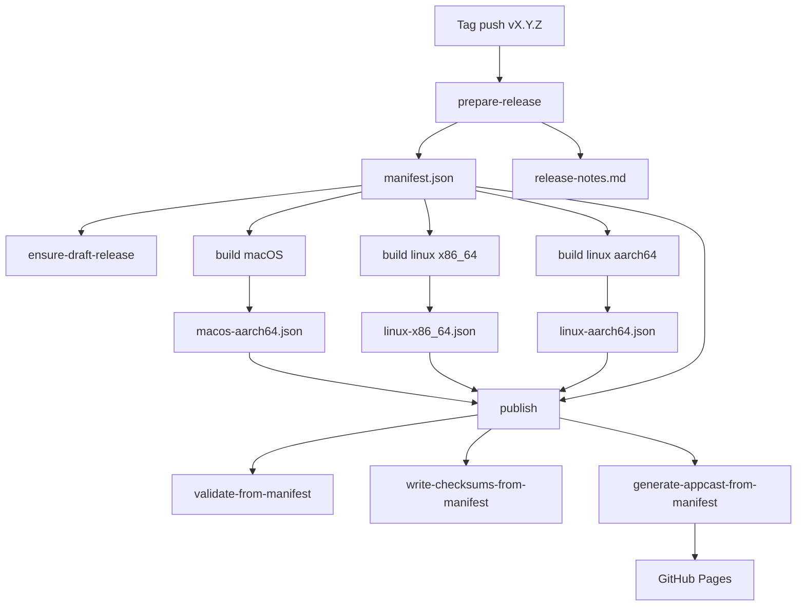

# Release Architecture

This document explains the release system in simple terms.

For the operator procedure, preflight checks, recovery rules, and post-release verification, use [docs/RELEASE-RUNBOOK.md](docs/RELEASE-RUNBOOK.md).

## Overview

`seance-build` is the source of truth for release metadata. GitHub Actions and packaging scripts should exchange files, not computed shell strings.

Platform build jobs provision Zig 0.15.2 as part of the workflow because vendored `libghostty-vt-sys` builds Ghostty from source via `zig build` during Rust compilation.

The core rule is:

- one step runs one command
- one command reads one manifest or produces one manifest
- cross-job handoff happens through files in `dist/release`

## Ownership

```text
┌──────────────────────────────────────────────────────┐
│                   seance-build                       │
│                                                      │
│ Owns:                                                │
│ - version and tag validation                         │
│ - release notes extraction                           │
│ - artifact naming                                    │
│ - release manifest and platform manifests            │
│ - appcast generation                                 │
│ - checksum generation and validation                 │
└──────────────────────────────────────────────────────┘
                 │                     │
                 │ reads/writes        │ reads/writes
                 ▼                     ▼
        GitHub Actions            Packaging wrappers
        release.yml               macOS / Linux scripts
```

## Manifest Files

| File | Written By | Read By | Purpose |
| --- | --- | --- | --- |
| `dist/release/manifest.json` | `seance-build prepare-release` | all jobs and publish steps | Top-level release contract |
| `dist/release/release-notes.md` | `seance-build prepare-release` | draft release creation | Changelog section for the tag |
| `dist/release/manifests/macos-aarch64.json` | macOS packaging step | publish step | Actual macOS outputs |
| `dist/release/manifests/linux-x86_64.json` | Linux x86_64 packaging step | publish step | Actual Linux x86_64 outputs |
| `dist/release/manifests/linux-aarch64.json` | Linux aarch64 packaging step | publish step | Actual Linux aarch64 outputs |
| `dist/release/SHA256SUMS.txt` | `seance-build write-checksums-from-manifest` | release upload | Final checksums |

## CI Flow



## Local Flow

For local release work, the preferred path is still through `seance-build` and the Makefile wrappers.

```bash
make release-version
make release-notes VERSION=0.1.0
make release-artifacts
make release-validate RELEASE_DIR=dist/release
make release-checksums RELEASE_DIR=dist/release
```

## Validation Gates

```text
Release gates:

1. Tag version must match Cargo workspace version
2. CHANGELOG.md must contain a section for that version
3. Expected platform artifacts must exist
4. Platform manifest files must exist
5. Sparkle metadata must exist before appcast generation
6. Checksums must be generated from the canonical artifact list
```

## Troubleshooting

- If `prepare-release` fails, check the tag and `CHANGELOG.md` first.
- If a platform upload fails, inspect the corresponding file in `dist/release/manifests/`.
- If publish validation fails, compare `manifest.json` against what was actually built into `dist/release`.
- If the appcast step fails, verify that `sparkle-item.json` was produced by the macOS packaging step.
