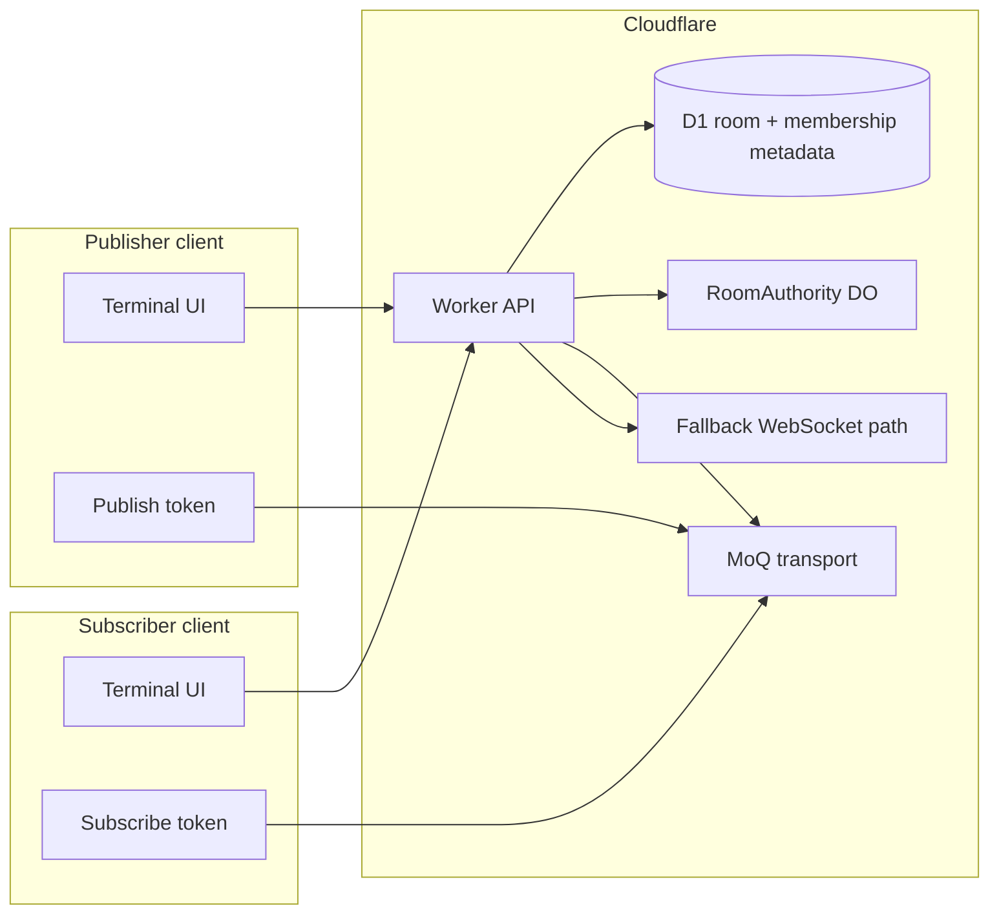
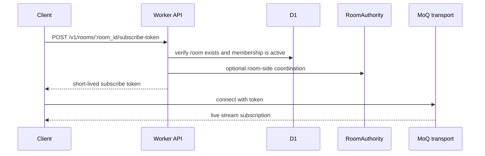

# Vault Multiplayer Architecture

## Purpose

Describe how future terminal multiplayer fits beside vault sync without collapsing the sync and live-streaming planes into one protocol.

## Scope

- realtime topology
- room authority model
- MoQ integration
- fallback transport
- vault-membership-based authorization

## Assumptions

- multiplayer authorization is derived from vault membership
- room metadata is stored server-side
- MoQ is used for live stream transport when available
- a fallback path exists for clients without working MoQ support

## Glossary

- **room**: multiplayer coordination object for a live session or broadcast context
- **publisher**: participant sending terminal stream frames
- **subscriber**: participant receiving stream frames
- **fallback transport**: non-MoQ realtime path used when MoQ is unavailable

## Design Principles

- keep vault sync durable and replayable
- keep multiplayer low-latency and ephemeral
- authorize multiplayer with the same vault identity model used for sync
- never grant room access without a fresh membership check

## Realtime Topology

## Room Model

Each room is linked to one vault:

- `room_id`
- `vault_id`
- `room_kind`
- `creator_user_id`
- optional `source_host_id`

Authorization rules:

- only active vault members can join
- publish and subscribe tokens are separate
- token TTL is short
- room token issuance is denied immediately after revocation

## Authorization Sequence

## Fallback Path

MoQ is the preferred transport, but the service must tolerate:

- unsupported browsers or runtimes
- WebTransport limitations
- temporary MoQ platform issues

Fallback policy:

- mint the same room-scoped authorization for fallback transport
- use RoomAuthority DO plus WebSocket path for presence and control-plane messages
- keep fallback separate from vault sync event channels

## Data Visibility

Visible server-side:

- room names
- room ids
- creator user id
- vault id
- token issuance metadata

Not visible server-side:

- decrypted vault contents
- user secrets
- terminal stream plaintext only if the chosen multiplayer encoding sends plaintext terminal frames

If end-to-end encrypted multiplayer is required later, it must be layered above the room auth model.

## Operational Notes

- room tokens should expire quickly
- room metadata should be garbage collected after inactivity
- room auth failures should be audited
- revocation should invalidate new token issuance immediately
- existing live sessions may have short revocation lag until token refresh or reconnect
