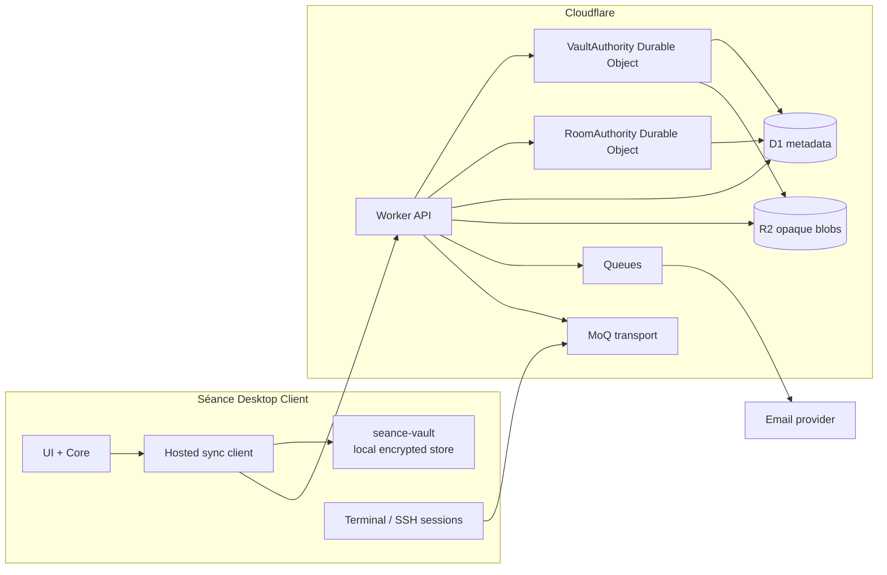
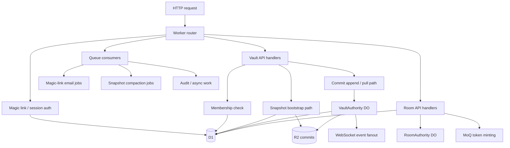

# Vault Sync Architecture

## Purpose

Define the hosted sync authority for encrypted vault replication and the platform boundaries needed to support future shared vaults and multiplayer terminal sessions.

## Scope

- Cloudflare-first backend architecture
- vault sync control plane and data plane
- component ownership
- trust boundaries
- why each storage or compute component exists

## Assumptions

- vault contents remain end-to-end encrypted
- `seance-vault` stays local-storage and merge-logic only
- hosted sync is built outside `seance-vault`
- `logical_clock` remains the vault conflict clock
- hosted replication adds `stream_seq` as the server replay cursor
- multiplayer transport uses MoQ, but vault sync does not

## Glossary

- **logical_clock**: vault-local monotonic merge clock embedded in encrypted records and deltas
- **stream_seq**: server-assigned append-only replication sequence for hosted replay ordering
- **bootstrap**: latest snapshot plus tail commits needed to initialize a new device
- **snapshot**: opaque encrypted full-vault export
- **commit**: opaque encrypted delta accepted by the hosted sync authority
- **vault authority**: per-vault Durable Object that serializes commit acceptance

## Overview

The hosted sync service is split into two planes:

- **Vault sync plane**
  - HTTPS snapshot bootstrap
  - HTTPS commit upload and pull
  - D1 metadata
  - R2 encrypted blobs
  - per-vault Durable Object sequencing
- **Multiplayer plane**
  - room/session authorization
  - realtime presence and room state
  - MoQ-based live stream transport

The service is intentionally blind to vault plaintext. It stores:

- user and membership metadata
- device and replica metadata
- commit ordering metadata
- opaque encrypted snapshot and delta payloads

## System Context

## Component Architecture

## Trust Boundaries

```mermaid
flowchart LR
    subgraph Plaintext["Client plaintext boundary"]
        P1[Decrypted hosts]
        P2[Decrypted credentials]
        P3[Decrypted keys]
        P4[Recovery passphrase]
    end

    subgraph Ciphertext["Encrypted payload boundary"]
        C1[VaultSnapshot]
        C2[VaultDelta]
        C3[Device enrollments in snapshot]
    end

    subgraph Metadata["Server-visible metadata boundary"]
        M1[Users / sessions]
        M2[Vault memberships]
        M3[Replica metadata]
        M4[stream_seq]
        M5[Audit rows]
        M6[Room auth metadata]
    end

    Plaintext --> Ciphertext
    Ciphertext --> Metadata
```

## What Runs Where

### Desktop App

- local vault encryption, decryption, and conflict application
- device unlock enrollment and recovery passphrase handling
- snapshot export and delta export
- snapshot import and delta import
- multiplayer publish and subscribe decisions in the client UI

### Worker API

- public HTTP surface
- auth verification
- membership checks
- bootstrap and pull handlers
- room token minting
- queue consumer entrypoints

### VaultAuthority Durable Object

- per-vault serialized commit acceptance
- idempotency enforcement
- `stream_seq` allocation
- commit event fanout to connected listeners
- coordination point for future shared-vault writes

### RoomAuthority Durable Object

- room-local realtime coordination
- presence signaling
- future session-side broadcast state

### D1

- relational control-plane metadata
- authoritative membership and replica lookup
- commit and snapshot manifests
- sessions, challenges, idempotency keys, audit rows

### R2

- opaque encrypted snapshot payloads
- opaque encrypted commit payloads
- payload integrity hashes checked against manifests

### Queues

- email delivery
- compaction jobs
- async repair or retry work

### MoQ

- live multiplayer transport only
- room-scoped publish and subscribe streams
- not used for durable vault replay

## Why Each Storage / Compute Choice Exists

| Component | Why it exists |
| --- | --- |
| Worker API | Single public entrypoint for auth, bootstrap, commit pull, and room auth |
| VaultAuthority DO | Prevents concurrent append races by making one authority per vault |
| RoomAuthority DO | Gives multiplayer sessions a consistent state owner without coupling to sync sequencing |
| D1 | Simple relational store for identities, memberships, manifests, idempotency, and audit state |
| R2 | Cheap storage for opaque encrypted blobs that may grow over time |
| Queues | Removes email and compaction work from the request path |
| MoQ | Purpose-built live distribution path for multiplayer session data |

## Replication Model

The replication model uses two clocks:

- `logical_clock`
  - produced by the client vault
  - used for encrypted-record precedence and merge rules
- `stream_seq`
  - produced by the server
  - used for replay ordering and pull cursors

This avoids a hosted race where two devices upload different `logical_clock = 5` commits and one gets missed by a client polling only on logical clocks.

## Eventing Model

The sync service does not send authoritative vault state over the realtime channel.

Realtime events are hints:

- `commit_available`
- `snapshot_compacted`
- `membership_changed`
- `vault_deleted`

Clients receive the hint, then pull the authoritative state over HTTPS by `after_seq`.

## Failure Model

### Safe ordering for commit visibility

1. write commit payload to R2
2. write commit manifest and new head to D1
3. fan out commit notification

This means:

- an R2 failure prevents the commit from becoming visible
- a D1 failure after an R2 write can leave an orphan blob, but not a visible partial commit

### Safe ordering for snapshot visibility

1. write snapshot blob to R2
2. write snapshot manifest
3. update vault latest snapshot pointer

## Shared Vault Readiness

The first milestone only activates owner-only vaults, but the architecture is intentionally ready for:

- membership rows beyond owner
- invite workflows
- role enforcement
- room authorization based on membership role

No schema rewrite should be required to move from owner-sync to shared-vault sync.

