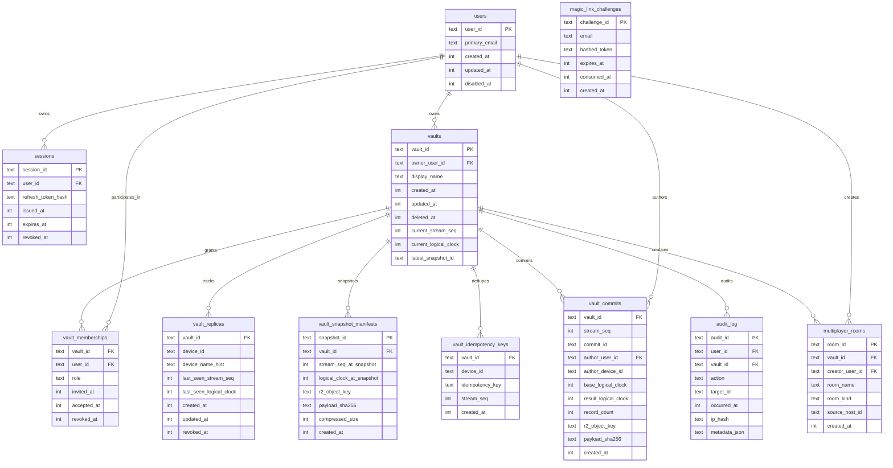
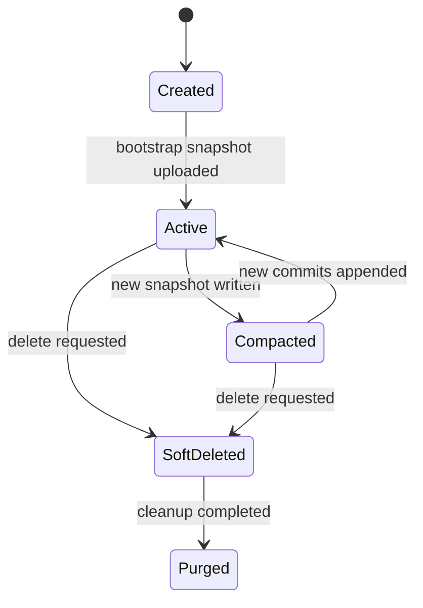
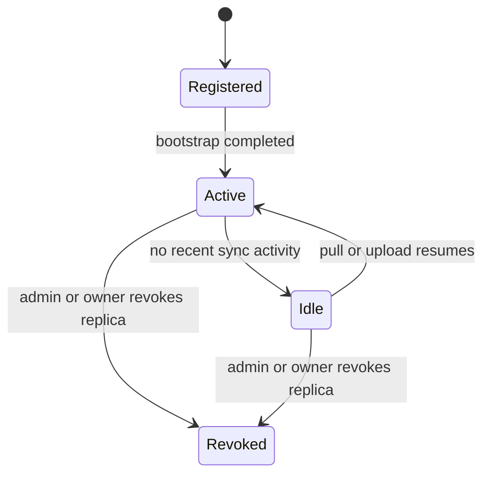

# Vault Sync Data Model

## Purpose

Describe the persistent server-side data model for hosted vault sync and future multiplayer authorization.

## Scope

- D1 relational schema
- R2 object naming
- Durable Object ownership model
- state transitions for vaults and replicas

## Assumptions

- D1 is the control-plane source of truth
- R2 stores opaque encrypted payloads only
- Durable Objects coordinate writes but do not replace relational metadata
- shared-vault readiness exists in schema before owner-only sync is enabled

## Glossary

- **manifest**: relational row describing an R2 blob
- **replica**: device-level hosted sync participant
- **authority**: per-vault or per-room Durable Object responsible for serialized coordination

## D1 Entities

| Table | Purpose |
| --- | --- |
| `users` | stable user identity |
| `magic_link_challenges` | single-use login challenges |
| `sessions` | refresh-token backed login sessions |
| `vaults` | vault metadata and current hosted head |
| `vault_memberships` | role and lifecycle for vault access |
| `vault_replicas` | device/replica tracking |
| `vault_snapshot_manifests` | latest and historical snapshot manifests |
| `vault_commits` | append-only commit manifests |
| `vault_idempotency_keys` | safe commit retry ledger |
| `multiplayer_rooms` | room metadata linked to vault access |
| `audit_log` | security and operator audit trail |

## ER Diagram



## R2 Object Naming

### Snapshots

```text
snapshots/<vault_id>/<snapshot_id>.json
```

### Commits

```text
commits/<vault_id>/<zero-padded-stream-seq>-<commit_id>.json
```

Properties:

- easy to inspect by vault
- stream order visible in key names
- append-only retention compatible
- safe to rebuild D1 manifests from R2 inventory if needed

## Durable Object Ownership Model

### VaultAuthority

Owns:

- commit append serialization
- `stream_seq` allocation
- notification fanout

Does not own:

- long-term manifests
- user identity
- room metadata

### RoomAuthority

Owns:

- room-local realtime coordination
- future presence state
- room-side event fanout

Does not own:

- vault membership source of truth
- commit ordering

## State Diagrams

### Vault Lifecycle



### Replica Lifecycle



## Head Tracking

Every vault keeps two hosted head values:

- `current_stream_seq`
- `current_logical_clock`

`current_stream_seq` is advanced only by accepted commits.

`current_logical_clock` is updated to the max of:

- current vault logical head
- incoming delta `to_clock`
- incoming record clocks
- uploaded snapshot header clock

## Data Visibility

### Visible in D1

- user email
- vault display name
- membership role
- device ids and last seen metadata
- room names
- audit metadata

### Visible in R2

- opaque encrypted snapshots
- opaque encrypted deltas

### Never visible server-side

- decrypted hosts
- decrypted credentials
- decrypted keys
- recovery passphrases
- master keys

