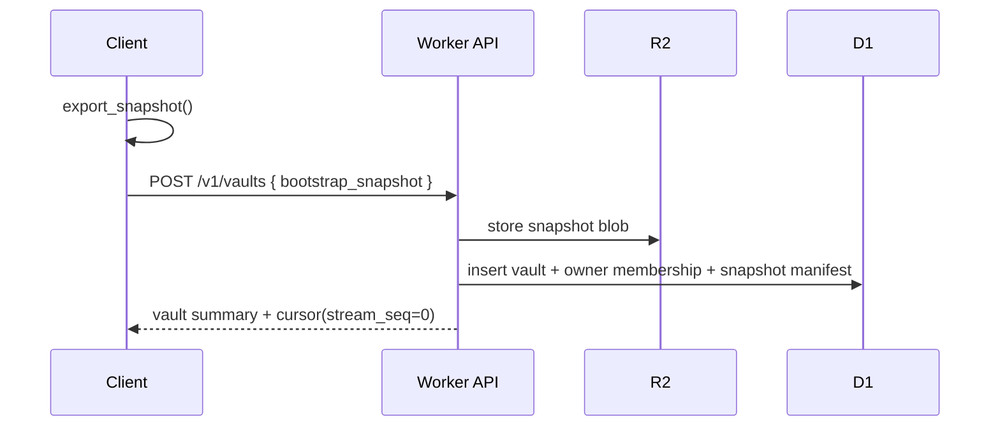
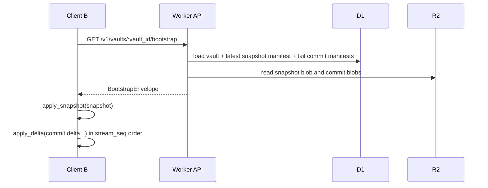
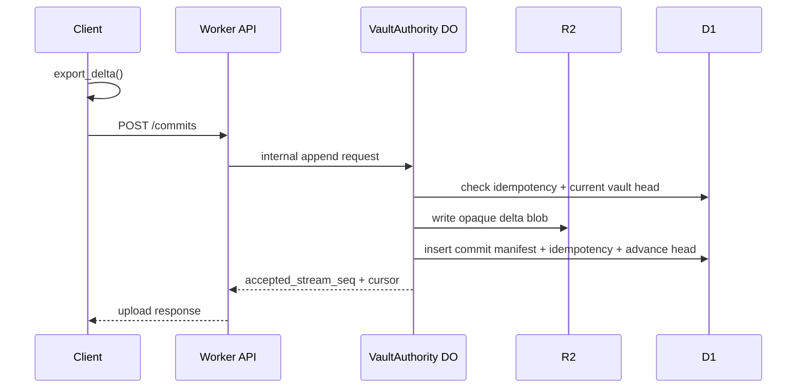
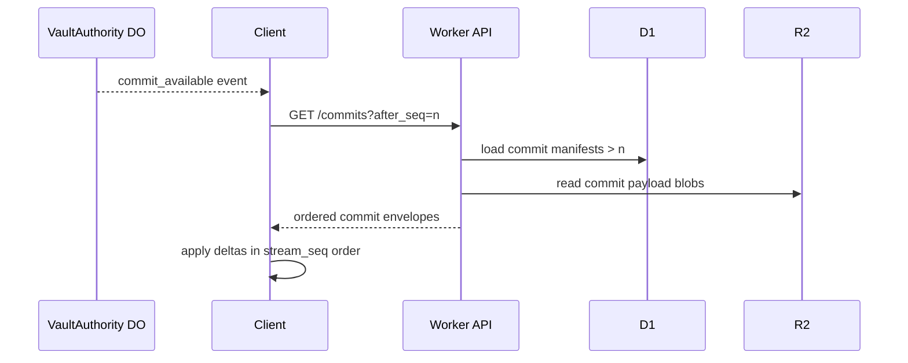
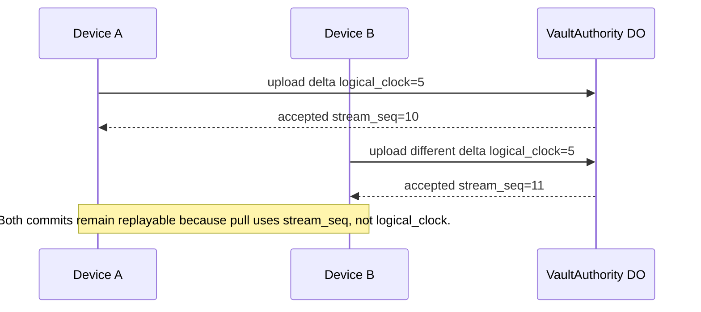
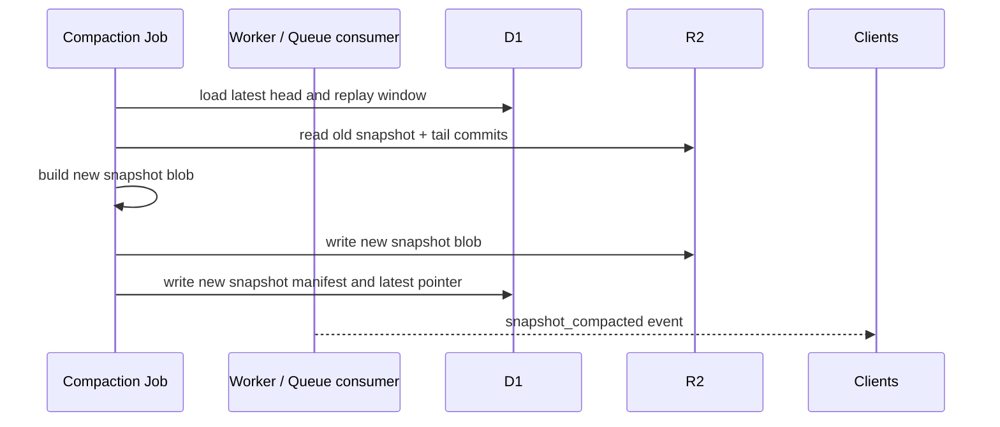

# Vault Sync Protocol

## Purpose

Define the HTTP and realtime protocol for hosted vault bootstrap, replication, auth, and multiplayer room authorization.

## Scope

- endpoint contracts
- request and response schemas
- auth requirements
- error behavior
- idempotency behavior
- retry behavior
- replication cursor semantics

## Assumptions

- all vault payloads are opaque encrypted JSON objects from `seance-vault`
- access tokens are bearer tokens
- refresh tokens are opaque rotation tokens
- commit upload bodies are bounded by server limits
- realtime notifications are hints only

## Glossary

- **bootstrap envelope**: latest snapshot plus tail commits
- **idempotency key**: per-device unique upload key to make retries safe
- **replication cursor**: `{ vault_id, stream_seq, logical_clock }`
- **tail commits**: commits after the snapshot used for a bootstrap response

## Common Rules

### Authentication

- auth endpoints are public
- all `/v1/vaults/*` and `/v1/rooms/*` endpoints require `Authorization: Bearer <access_token>`

### Error Envelope

```json
{
  "error": "Human readable message",
  "details": null
}
```

### Idempotency

- `POST /v1/vaults/:vault_id/commits` requires `idempotency_key`
- duplicate upload from the same `vault_id + device_id + idempotency_key` returns the original acceptance result
- `PUT /v1/vaults/:vault_id/snapshot` includes `idempotency_key` for future compaction safety even if the first scaffold does not deduplicate snapshot uploads yet

### Retry

- safe to retry magic-link start
- safe to retry commit upload with the same idempotency key
- safe to retry commit pull with the same `after_seq`
- safe to retry bootstrap fetch

## Endpoint Summary

| Method | Path | Auth | Purpose |
| --- | --- | --- | --- |
| `POST` | `/v1/auth/magic-link/start` | no | start login challenge |
| `POST` | `/v1/auth/magic-link/verify` | no | redeem magic link |
| `POST` | `/v1/auth/refresh` | no | rotate refresh token |
| `POST` | `/v1/auth/logout` | no | revoke refresh token |
| `GET` | `/v1/vaults` | yes | list visible vaults |
| `POST` | `/v1/vaults` | yes | create vault with bootstrap snapshot |
| `GET` | `/v1/vaults/:vault_id` | yes | fetch vault summary |
| `GET` | `/v1/vaults/:vault_id/bootstrap` | yes | fetch snapshot plus tail commits |
| `PUT` | `/v1/vaults/:vault_id/snapshot` | yes | upload fresh snapshot |
| `POST` | `/v1/vaults/:vault_id/commits` | yes | upload encrypted delta |
| `GET` | `/v1/vaults/:vault_id/commits` | yes | pull commits after `stream_seq` |
| `GET` | `/v1/vaults/:vault_id/events` | yes | WebSocket event channel |
| `POST` | `/v1/rooms` | yes | create multiplayer room |
| `POST` | `/v1/rooms/:room_id/join` | yes | join room metadata path |
| `POST` | `/v1/rooms/:room_id/publish-token` | yes | mint MoQ publish token |
| `POST` | `/v1/rooms/:room_id/subscribe-token` | yes | mint MoQ subscribe token |

## Request / Response Shapes

### Start Magic Link

Request:

```json
{
  "email": "user@example.com"
}
```

Response:

```json
{
  "challenge_sent": true
}
```

### Verify Magic Link

Request:

```json
{
  "token": "opaque-magic-link-token"
}
```

Response:

```json
{
  "session": {
    "access_token": "bearer-token",
    "refresh_token": "opaque-refresh-token",
    "user": {
      "user_id": "user-123",
      "primary_email": "user@example.com",
      "created_at": 1710000000,
      "updated_at": 1710000000,
      "disabled_at": null
    }
  }
}
```

### Create Vault

Request:

```json
{
  "vault_id": "vault-123",
  "display_name": "Personal",
  "bootstrap_snapshot": {
    "header": {},
    "recovery_bundle": {},
    "device_enrollments": [],
    "records": []
  }
}
```

Response:

```json
{
  "vault": {},
  "cursor": {
    "vault_id": "vault-123",
    "stream_seq": 0,
    "logical_clock": 12
  }
}
```

### Upload Commit

Request:

```json
{
  "idempotency_key": "idem-123",
  "author_device_id": "device-123",
  "base_logical_clock": 12,
  "delta": {
    "vault_id": "vault-123",
    "from_clock": 12,
    "to_clock": 13,
    "records": []
  }
}
```

Response:

```json
{
  "accepted_stream_seq": 41,
  "replication_cursor": {
    "vault_id": "vault-123",
    "stream_seq": 41,
    "logical_clock": 13
  },
  "head_logical_clock": 13
}
```

### Pull Commits

Response:

```json
{
  "commits": [
    {
      "stream_seq": 41,
      "commit_id": "commit-123",
      "author_device_id": "device-123",
      "created_at": 1710000000,
      "delta": {}
    }
  ],
  "next_after_seq": 41,
  "head_stream_seq": 41,
  "head_logical_clock": 13
}
```

### Bootstrap

Response:

```json
{
  "vault": {},
  "snapshot": {},
  "commits_after_snapshot": [],
  "cursor": {
    "vault_id": "vault-123",
    "stream_seq": 41,
    "logical_clock": 13
  }
}
```

## Replication Cursor Semantics

The hosted sync protocol always moves forward by `stream_seq`.

Clients persist:

- last applied `stream_seq`
- current local vault `logical_clock`

Rules:

- pull uses `after_seq`
- server returns commits ordered by `stream_seq`
- client applies returned deltas in order
- `logical_clock` remains an attribute inside each delta, not the hosted pull cursor

## Sequence Diagrams

### First Device Bootstrap



### Second Device Bootstrap



### Delta Upload



### Delta Pull After Notification



### Concurrent Equal-Clock Uploads



### Snapshot Compaction



## Endpoint-Specific Rules

### `POST /v1/vaults/:vault_id/commits`

- validates bearer auth
- validates vault membership
- validates `delta.vault_id`
- enforces body and record-count limits
- returns original acceptance result on idempotent retry

### `GET /v1/vaults/:vault_id/commits`

- `after_seq` defaults to `0`
- `limit` defaults to `100`
- `limit` is capped server-side

### `GET /v1/vaults/:vault_id/events`

- requires authenticated membership
- upgrades to WebSocket
- emits hints only

### Room Token Endpoints

- require authenticated membership in the vault linked to the room
- return short-lived signed publish or subscribe tokens
- do not expose raw room authority internals

## Error Cases

| Case | Status | Behavior |
| --- | --- | --- |
| missing bearer token | `401` | reject |
| invalid or expired magic link | `401` | reject |
| unknown vault | `404` | reject |
| revoked membership | `404` or `403` | treat as inaccessible |
| invalid commit shape | `400` | reject |
| too many records in one commit | `413` | reject |
| missing snapshot payload in R2 | `500` | treat as data integrity incident |
