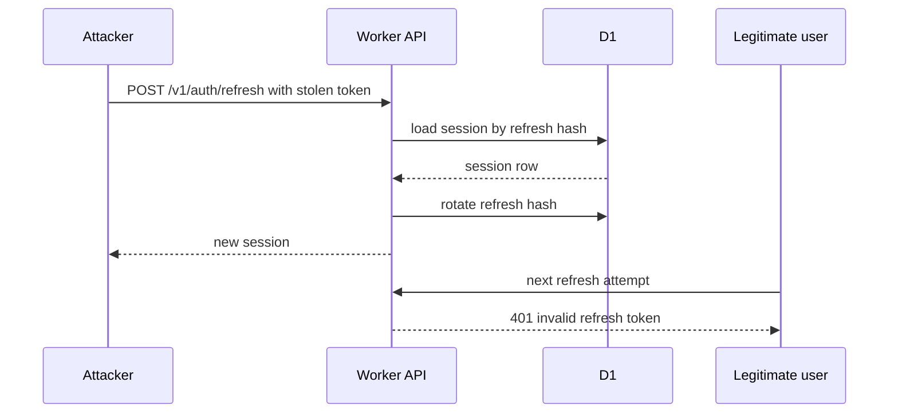
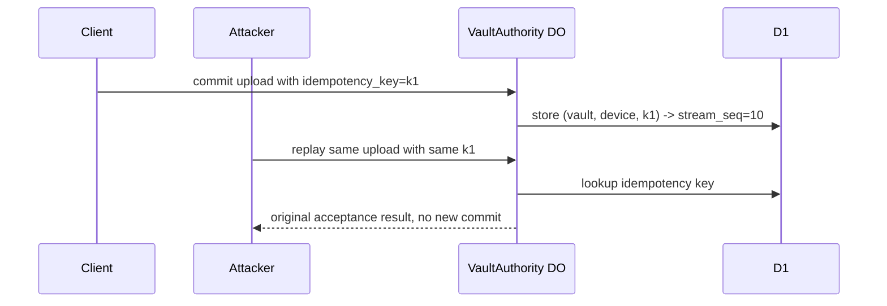
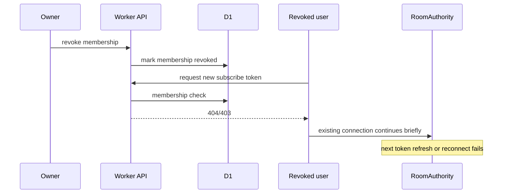

# Vault Sync Threat Model

## Purpose

Describe the trust boundaries, threat surface, core attacks, and mitigations for the hosted sync and multiplayer authorization service.

## Scope

- auth threats
- transport threats
- storage threats
- replay risks
- membership and replica revocation risks
- multiplayer authorization risks

## Assumptions

- clients are trusted to hold plaintext and keys
- the server is honest-but-curious with respect to encrypted vault payloads
- access tokens are short-lived bearer credentials
- refresh tokens are stored and rotated server-side

## Glossary

- **honest-but-curious**: server executes protocol correctly but may observe any metadata it can see
- **replay**: reusing a previously valid token or upload body
- **revocation lag**: time between revocation and all active sessions observing it

## Security Objectives

- server cannot decrypt vault payloads
- revoked users and replicas lose future sync and room access
- replayed commit uploads do not create duplicate commits
- replayed login tokens do not mint duplicate sessions
- data-integrity failures are detectable from manifests and hashes

## Threat Surface

```mermaid
flowchart TD
    Auth[Auth surface]
    Transport[Transport surface]
    Storage[Storage surface]
    Replay[Replay surface]
    Revocation[Revocation surface]
    Multiplayer[Multiplayer authorization]

    Auth --> Magic[Magic link theft or replay]
    Auth --> Refresh[Refresh token theft]

    Transport --> CommitUpload[Commit upload tampering]
    Transport --> EventChannel[Realtime event abuse]

    Storage --> D1State[Manifest corruption]
    Storage --> R2Blob[Blob loss or mismatch]

    Replay --> Idem[Commit replay]
    Replay --> LinkReplay[Magic link replay]

    Revocation --> MemberAccess[Revoked member still syncing]
    Revocation --> ReplicaAccess[Revoked replica still pulling]

    Multiplayer --> RoomJoin[Unauthorized room join]
    Multiplayer --> StreamToken[Publish or subscribe token abuse]
```

## Trust Boundaries

- client plaintext boundary
- encrypted payload boundary
- server-visible metadata boundary
- external email provider boundary
- MoQ transport boundary

## Primary Controls

### Auth Controls

- single-use magic links
- challenge expiry
- refresh token rotation
- disabled user checks on authenticated requests

### Replication Controls

- commit idempotency keys
- append-only `stream_seq`
- manifest hash checks
- membership check before bootstrap, pull, upload, or room token minting

### Storage Controls

- R2 payload hash stored in D1
- no plaintext inspection required
- soft-delete before purge
- audit rows for auth, vault, snapshot, and commit actions

### Multiplayer Controls

- room access derived from vault membership
- short-lived publish and subscribe tokens
- room authority never bypasses D1 membership source of truth

## Attack Flows

### Stolen Refresh Token

Mitigations:

- short access-token lifetime
- refresh rotation
- audit rows on refresh
- future device/session management UI should expose forced logout

### Replayed Commit Upload

Mitigations:

- per-device idempotency ledger
- append authority centralized in VaultAuthority DO

### Revoked Membership Keeps Subscribing

Mitigations:

- membership checked on every new token mint
- token TTL kept short
- event channel can emit `membership_changed`

## Residual Risks

- bearer access tokens are replayable until expiry if stolen
- current scaffold uses placeholder local signing configuration and requires production secret rotation before deploy
- metadata such as email, vault names, room names, and device ids remain visible server-side
- live room connections may have short revocation lag until reconnect or token refresh

## Detection Signals

- spikes in magic-link start volume
- spikes in refresh rotation failures
- duplicate idempotency hits from unexpected IP patterns
- repeated missing R2 blob reads for valid D1 manifests
- repeated room token mint failures after membership changes

## Integrity Checks

- D1 commit manifest count matches R2 object count for replay windows
- payload hash matches manifest hash during rebuild or verification
- latest snapshot pointer references an existing manifest and R2 object

